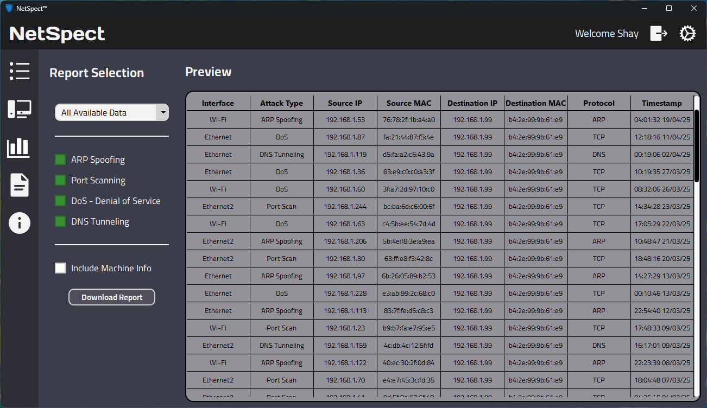
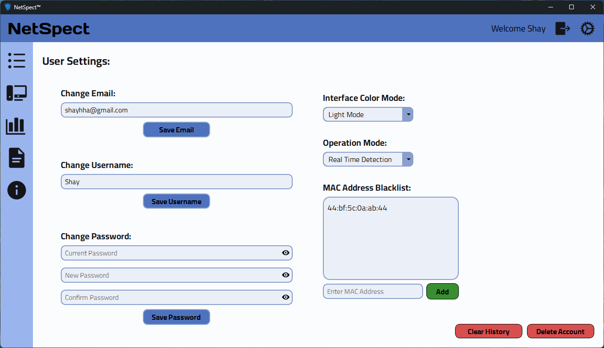
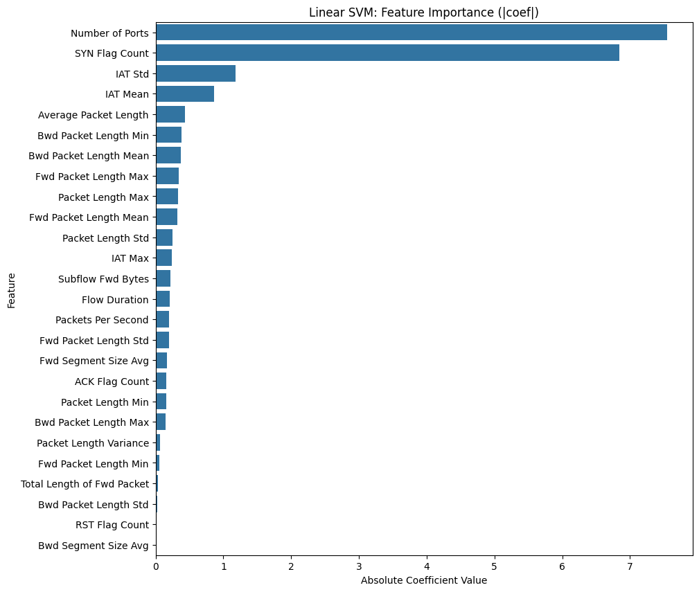

<div align='center'>
  
  <div id="toc">
    <ul align="center" style="list-style: none">
      <summary>
        <h1><b>NetSpect - Real-Time Intrusion Detection System (IDS)</b></h1>
      </summary>
    </ul>
  </div>

[](https://www.python.org/downloads/release/python-3130/)
[](https://doc.qt.io/qtforpython/)
[](https://github.com/secdev/scapy/)
[](https://scikit-learn.org/stable/)
[](https://www.microsoft.com/en-us/sql-server/sql-server-2022/)<br>
[](https://npcap.com/)

[](https://www.gnu.org/licenses/gpl-3.0)
</div>

<h1></h1>

**Final Project for B.Sc. in Software Engineering**

**NetSpect** is an advanced, real-time, cross-platform network *[Hybrid Intrusion Detection System (HIDS)](https://www.stamus-networks.com/blog/what-are-the-three-types-of-ids#:~:text=Hybrid%20IDS%3A%20A%20hybrid%20intrusion,based%20detection%20for%20novel%20attacks.)* built with Python 3.13, it leverages signeture-based algorithms and anomaly-based machine learning models to identify and alert on multiple types of network cyberattacks, detecting intrusions such as:

- [ARP Spoofing](https://www.crowdstrike.com/en-us/cybersecurity-101/social-engineering/arp-spoofing/)
- [Port Scanning](https://www.paloaltonetworks.com/cyberpedia/what-is-a-port-scan)
- [DoS TCP SYN Floods](https://www.cloudflare.com/learning/ddos/syn-flood-ddos-attack/) & [HTTP GET Floods](https://www.cloudflare.com/learning/ddos/http-flood-ddos-attack/)
- [DNS Tunneling](https://www.checkpoint.com/cyber-hub/network-security/what-is-dns-tunneling/)  

<br>  

## Overview
**NetSpect is a Hybrid IDS** developed as the culmination of our four-year Software Engineering degree. Engineered for **accuracy**, **efficiency**, and **ease of use** it features an intuitive graphical user interface (GUI) paired with a robust backend to deliver a **comprehensive solution for real-time threat detection** in local networks. By integrating **custom-designed algorithms** with **machine learning**, NetSpect combines signature-based and anomaly-based detection methods to monitor and analyze network traffic, ensuring **precise**, **rapid**, and **reliable detection** of malicious activities.

Our software includes a specialized algorithm for ARP Spoofing detection, capable of **identifying both IP-MAC and MAC-IP spoofing across individual subnets in real time**. This algorithm systematically analyzes incoming ARP traffic, organizes it by subnet, and verifies the absence of duplications indicative of spoofing attempts. Enhanced by a **cache-based mechanism**, it optimizes data processing to achieve efficient and accurate detection, providing robust protection against network spoofing threats with minimal performance impact.

In addition to that, the machine learning models that we built were trained on **datasets we manually collected** from various Ethernet and Wi-Fi networks. These datasets include benign network traffic as well as **attack traffic synthesized from real-world scenarios** we created in controlled environments, covering threats such as Port Scanning, DoS TCP SYN Floods, DoS HTTP GET Floods, and DNS Tunneling. This hands-on approach to data collection ensures our models are finely tuned to recognize both typical network behavior and sophisticated attack patterns effectively.

NetSpect cleverly employs a **multi-threaded architecture** to distribute tasks across multiple worker threads, delivering **strong performance** and **real-time detection** capabilities. This design enables the application to maintain high responsiveness and process network traffic efficiently, even under significant load. By leveraging multi-threading, NetSpect provides a scalable and dependable solution for monitoring and securing local networks in dynamic environments.

<br>  

## Features
### Core Features

-  **Real-Time Detection**  
  Detects ARP Spoofing, Port Scanning, DoS and DNS Tunneling network attacks in real time with high accuracy and efficiently.

-  **Signeture-Based Algorithms**  
  Implements a custom logic-based algorithm to detect ARP spoofing attack in network traffic that incorporates an authentication mechanism for each IP-MAC address pair within every subnet and adapts to legitimate network changes.

-  **Anomaly-Based Machine Learning Classification**  
  Uses pre-trained **SVM models** to classify network flows and detect Port Scanning, DoS and DNS Tunneling attack signatures in real time.

-  **Data Collection**  
  Provides the ability to switch between Detection and Data Collection modes. In Data Collection mode, network packets are aggregated and stored in a **CSV** file for further analysis.

- **MAC Address Blacklist**  
  Allows users to add MAC addresses to a blacklist. Any attacks originating from these addresses will be ignored during detection.
  
### Interface Features

-  **Alert Center**  
  Monitor real-time and past alerts directly in the app, and control detection with start and stop functionality.

- **Analytics Center**  
  Allows the user to visualize their previous alerts in a simple and informative way, organized by year.

- **Incident Reports**  
  Enables users to filter and export historical alerts into TXT or CSV report formats for future analysis.

-  **Modern GUI with Dark/Light Mode**  
  Clean and responsive user interface built with user experience in mind, featuring light and dark mode color schemes.

### User & System Features

-  **User Authentication**  
  Supports **login** and **registration**, along with a guest mode with limited functionality.

- **Account Management**  
  Offers users the ability to changing their password, username, and email address. Also includes a password recovery feature in case of forgotten credentials.

- **System Information**  
  Displays detailed information about the user’s network interface, system details and the current program version.

### Performance & Compatibility Features

-  **Multithreaded Architecture**  
  Efficient and responsive performance with concurrent data capture and processing.

-  **System Tray Integration**  
  Runs in the background and shows native tray notifications upon attack detection.

-  **Cross-Platform**  
  Compatible with Windows, Linux, and macOS thanks to Python 3.13 and PySide6.

<br>  

## Technologies Used

| Technology | Purpose |
|------------|---------|
| **[Python 3.13](https://www.python.org/downloads/release/python-3130/)** | Core programming language for development and scripting. |
| **[PySide6](https://doc.qt.io/qtforpython/)** | A framework for building the graphical user interface (GUI). |
| **[Scapy](https://github.com/secdev/scapy)** | A powerful packet manipulation library used for network traffic analysis. |
| **[SQL Server](https://www.microsoft.com/en-us/sql-server/sql-server-2022)** | Database management system for storing and retrieving user data. |
| **[Joblib](https://joblib.readthedocs.io/)** | Library utilized for saving and loading machine learning models efficiently. |
| **[Scikit-learn](https://scikit-learn.org/)** | Machine learning library leveraged for model training and prediction. |

<br>  

## Installation & Setup

Our project offers two installation options: using a Windows installer for a straightforward setup, or cloning the repository from GitHub for manual installation.

### Windows Installer:
Inside the setup folder, locate the NetSpectSetup.7z file and extract it to your preferred location. Then, double-click NetSpectSetup.exe to launch the installation wizard for a quick and easy setup.

### Clone The Repository:

Use the following commands to install the project in your preferred location:

```shell
git clone https://github.com/Shayhha/NetSpect
cd NetSpect
```

### Install Requirements:

```shell
pip install -r requirements.txt
```

<br>

## Additional Requirements:
After that, make sure to download and install the ODBC Driver and Npcap by following the instructions below.
Finally, configure the .env file with your connection string to enable seamless integration with your SQL Server database.

### Install ODBC Driver:

In order to use the application and connect to your SQL Server database, you must install the **[Microsoft ODBC Driver for SQL Server](https://learn.microsoft.com/en-us/sql/connect/odbc/download-odbc-driver-for-sql-server?view=sql-server-ver15)**.

### Configure .env Database File:
Navigate to the database folder, create new .env file and insert the following:

```shell
DB_CONNECTION_STRING="
DRIVER={ODBC Driver 17 for SQL Server};
SERVER=your_server_name;
DATABASE=your_database_name;
Trusted_Connection=yes;
"
APP_EMAIL="your_email_address"
APP_PASSWORD="your_email_password"
APP_EMAIL_HOST="your_smtp_server"
```

### Install Npcap (Only On Windows):

Make sure to install **[Npcap](https://npcap.com/#download)** before running the application. It's required for network packet capturing.

### Install Additional Fonts:
Navigate to the interface/Fonts folder, extract the Cairo and Days_One ZIP archives, and install the included fonts.

<br>  

## How To Run The Application:
If you installed the application using the setup installer, you can launch it using the desktop shortcut.

Otherwise, use the following commands:

- **On Windows**
  ```shell
  cd src/main
  python NetSpect.py
  ```
  
- **On macOS / Linux**  
  You must run the application with elevated privileges to allow network monitoring:
  > This is necessary because raw packet capturing requires administrative/root permissions on Unix-based systems.
  
  ```shell
  cd src/main
  sudo python NetSpect.py
  ```

<br>  

## Screenshots

The following screenshots showcase the application's interface, functionality, and user experience across various scenarios:

### Dark Mode:

<br>*Login popup with registration and reset password*

<br>


<br>*Home page and alert history*

<br>


<br>*Report page with filtering and saving alert reports*


### Light Mode:

<br>*Analytics page for visualizing alert history by year*

<br>


<br>*Settings page for user account managment and MAC address blacklist*

<br>  

## Research Results

As part of this project, we **conducted in-depth research** into existing techniques for detecting several types of network cyber attacks, including ARP Spoofing, Port Scanning, Denial of Service (DoS), and DNS Tunneling.
This research enabled us to develop a **signature-based detection algorithm for ARP Spoofing attacks** that minimizes false positives by incorporating a **custom authentication mechanism** and intelligently **handling legitimate network changes**, enabling **real-time detection** across multiple subnets.

Furthermore, we developed **two Support Vector Machine (SVM)** models for **anomaly-based detection of Port Scanning, DoS, and DNS Tunneling attacks**. These models leverage a **unique traffic segmentation** approach and a carefully curated feature selection process, enabling **real-time detection** with outstanding performance, achieving up to 100% accuracy in our evaluations. To ensure the reliability and generalizability of our models, we employed **K-Fold cross-validation** during the training and evaluation process.

To support this effort, we **manually collected two unique datasets** using our application across **diverse network environments**, containing both **benign and real-world attack traffic**. These datasets were crafted specifically for our project and enhanced with **custom feature selection** for effective model training.

In conclusion, our project successfully **delivered a real-time IDS** capable of accurately identifying four critical types of network cyber attacks: Port Scanning, DoS, ARP Spoofing, and DNS Tunneling through an optimized, **multi-threaded solution** integrating detection algorithms and machine learning models, offering a reliable and **user-friendly** solution for modern network security challenges.

<br>

### ARP Spoofing Detection Algorithm Pseudocode:


<br>*Algorithm pseudocode for detecting ARP Spoofing*

### Port Scanning & DoS Linear SVM Model:


<br>*Distribution of benign and attack flows*

<br>


<br>*Feature importance calculation based on linear SVM coefficient*

<br>


<br>*Performance metrics and confusion matrix*

<br>


<br>*K-Folds cross-validation to ensure no overffiting during training*


### DNS Tunneling Linear SVM Model:


<br>*Distribution of benign and attack flows*

<br>


<br>*Feature importance calculation based on linear SVM coefficient*

<br>


<br>*Performance metrics and confusion matrix*

<br>


<br>*K-Folds cross-validation to ensure no overffiting during training*

<br>

## Dependencies

Our application relies of the following dependencies in order to work properly:
> You can install them via the requirements.txt file as mentioned in [Installation & Setup](#installation--setup).

- PySide6
- scapy
- numpy
- pandas
- joblib
- scikit-learn
- python-dotenv
- pyodbc


**Important** 
- On Windows based systems **[Npcap](https://npcap.com/#download)** must be installed to enable packet analysis and capturing.
- On Linux and macOS you have to run the application with administrative privileges to enable packet analysis and capturing.
- In order connect to your SQL Server database you must install **[Microsoft ODBC Driver for SQL Server](https://learn.microsoft.com/en-us/sql/connect/odbc/download-odbc-driver-for-sql-server?view=sql-server-ver15)**.


<br>  

## Contacts

- **Shay Hahiashvili**
  - Email: [shayhha@gmail.com](mailto:shayhha@gmail.com)
  - GitHub: [https://github.com/Shayhha](https://github.com/Shayhha)
    
- **Maxim Subotin**
  - Email: [maxim.sub21@gmail.com](mailto:maxim.sub21@gmail.com)
  - GitHub: [https://github.com/MaxSubotin](https://github.com/MaxSubotin)

<br>  

## License

**NetSpect** is open-source software licensed under the **GNU General Public License v3.0 (GPLv3)**.  
For full terms and conditions, please refer to the [LICENSE](LICENSE.txt) file.

© All rights to the original code, algorithms, and intellectual property are **reserved** and **owned exclusively** <br> by **Shay Hahiashvili and Maxim Subotin**.

By using or modifying this software, you agree to comply with the terms of the GPLv3 license.
